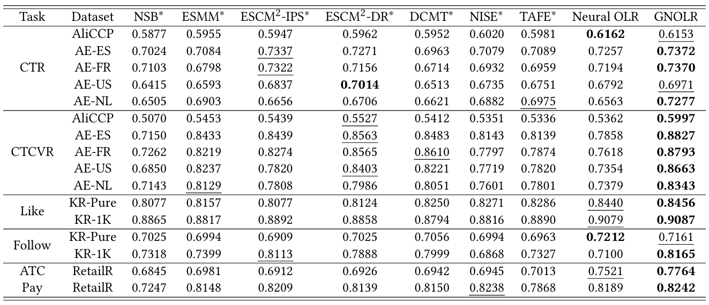
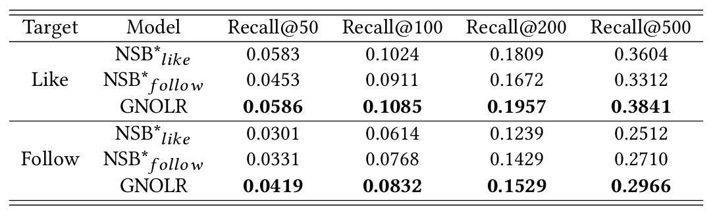

# GNOLR

This repository provides a PyTorch reference implementation of the main models and training procedure described in our [paper](https://arxiv.org/abs/2505.20900v2):

> Zhongjin Zhang*, Yu Liang*, Cong Fu, Yuxuan Zhu, Kun Wang, Yabo Ni, Anxiang Zeng and Jiazhi Xia. Embed Progressive Implicit Preference in Unified Space for Deep Collaborative Filtering. KDD 2025.

## Quick Start

We recommend installing the dependencies using `requirements.txt`. This setup has been tested with Ubuntu 18.04, CUDA 12.1, and Python 3.12.
```shell
pip3 install -r requirements.txt
```

We have provided script files in `run_scripts_shell/` for running various models on different datasets for ranking tasks. You can execute them using the following format.
```shell
./run.sh <device> <inference>
```
Example:
```shell
./run_scripts_shell/multi-task/kr-pure/gnolr.sh cuda:0 false
```

## Project Structure

```bash
.
├── data_process/             # data_loader code and feature.json for data statistics and schema
├── model/                    # Implementation of all baselines and proposed models
├── run_scripts_shell/        # Shell scripts to run all single-task and multi-task experiments
├── script/                   # Shared training script (Python) for all models
├── util/                     # Utility functions: loss, metric computation, general utils
├── main.py                   # Entry point script for running training and evaluation
├── requirements.txt          # List of required Python packages and dependencies
├── test_kuairand_recall_k.py # Script for evaluating recall@k on the KuaiRand dataset
└── README.md                 # This file
```

## Dataset

We use five public datasets: Ali-CCP, AE, KuaiRand, RetailRocket and MovieLens.

* Ali-CCP: An e-commerce dataset from Taobao’s recommender system, containing two implicit feedback types (click and pay). To align with the collaborative filtering setup, we discard user-item cross features and use only user-side and item-side features. [Official Page](https://tianchi.aliyun.com/dataset/408)
* AE: An e-commerce dataset from AliExpress’s search logs, with four sub-datasets from different country markets (AE-ES, AE-FR, AE-NL, AE-US). Each sub-dataset includes click and pay feedback. [Official Page](https://tianchi.aliyun.com/dataset/74690)
* KuaiRand: A video recommendation dataset from the Kuaishou app. We use two versions (KR-Pure, KR-1K) of it, differing by their user and item sampling strategies. Two types of implicit feedback, likes and follows, are used in modeling. [Official Page](https://kuairand.com/)
* RetailRocket: A dataset from a real-world e-commerce website, containing three types of user behaviors: click, add-to-cart (ATC), and Pay. We use the latter two. [Official Page](https://www.kaggle.com/datasets/retailrocket/ecommerce-dataset)
* MovieLens: A widely used movie recommendation dataset, with two versions (ML-1M, ML-20M). We set a rating threshold ($> 4$) to create binary labels to simulate implicit feedback. [Official Page](https://grouplens.org/datasets/movielens/)

To comply with the independent embedding requirement, we omit cross features from our implementation. The specific features used in each dataset can be found in the corresponding `feature.json` files under the `data_process/` directory, which also include schema descriptions and basic statistics. For further reproducibility details, please refer to Appendix A.2 Reproducibility in our paper.

## Experimental Results

The following figures showcase key experimental results from our study, including performance comparisons for multi-task ranking and multi-task recall tasks.




## Citation
If you find this repository helpful, please consider citing our paper:
```bibtex
@inproceedings{GNOLR,
  author={Zhongjin Zhang, Yu Liang, Cong Fu, Yuxuan Zhu, Kun Wang, Yabo Ni, Anxiang Zeng and Jiazhi Xia.},
  title={Embed Progressive Implicit Preference in Unified Space for Deep Collaborative Filtering},
  booktitle={{KDD}},
  year={2025}
}
```